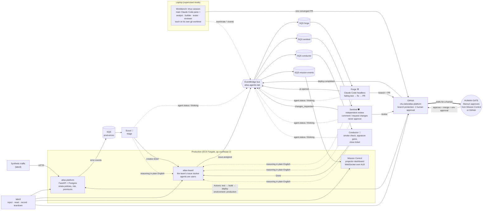

# ATLAS Agentic SDLC Demo Lab — architecture

One VPC, one bus, one gate. Agents do the work; a human makes the decision.

## The two modes

**Unattended.** Nobody is watching. A defect reaches production; synthetic traffic trips it; the
platform ships a structured error event; Scout clusters the events and writes a ticket; Forge
(Claude Code, headless, in a container) clones the repo, reads `CLAUDE.md`, reproduces the bug with
a failing test, fixes it, verifies the suite, and opens a pull request; Sentinel reviews it and may
send it back; the pipeline stops at the human gate; on approval GitHub Actions deploys; Conductor
verifies production and closes the ticket. Every step is visible on Mission Control and on the ticket.

**Supervised.** The presenter drives Claude Code in a tmux pane. When it delegates, real teammate
panes appear on the right, each a separate Claude Code process on its own git worktree and branch,
with a distinct role (analyst, builder, tester, reviewer). The main session collects their work,
reconciles the branches, and opens one PR, which lands at the same human gate.

## Where the line is drawn, and how it is enforced

Authority is data, not prose. Each agent ships a YAML block (`agents/defs/*.yaml`) stating what it
may do; the code checks it before side effects (`Agent.guard`), a violation is recorded on the ticket
and the dashboard, and the fleet card shows the badges. Three mechanisms make the human gate real
rather than decorative:

1. GitHub branch protection on `main` requires one approving review, and the agents act as a GitHub
   App whose own approval would not count anyway. Sentinel's client refuses `APPROVE` outright.
2. The `production` GitHub environment has a required reviewer, so even a merged change does not
   deploy until a human approves the deployment.
3. Mission Control's Approve button acts as the human (with the human's own token), does both
   approvals, and emits `human.approved`; nothing else in the system can emit that event.

## Infrastructure

Terraform, one root module (`infra/terraform`), one `terraform destroy`. VPC `10.42.0.0/16` with two
public subnets and no NAT: tasks carry public IPs and security groups accept inbound only from the
ALB. One ALB with port-based listeners (80 dashboard, 8081 board, 8082 platform; no domain), basic
auth in each app. One RDS Postgres `db.t4g.micro` (three databases; master password managed by RDS
in Secrets Manager, never in state). SQS queues per agent fed by EventBridge rules; the platform
writes `prod-errors` directly. ECR per image, CloudWatch logs with 3-day retention, a tag-based
resource group, and an OIDC role for GitHub Actions. Fargate Spot for agents, on-demand for the
three web services. Everything tagged `Project=atlas-agentic-lab, Lifecycle=ephemeral`.

## Event contract

Everything speaks `docs/EVENTS.md`: `Source = atlas.<component>`, `DetailType = <domain>.<verb>`, a
common envelope (`ts`, `actor` {handle, kind human|agent, mode autonomous|supervised}, `ticket`,
`summary` in plain English, `authority`, `telemetry`). Mission Control derives the pipeline stage
per ticket from these events and persists them, which is what makes `labctl record` and replay possible.

## Repositories

- `chu-labs/atlas-platform` — the system under test. `CLAUDE.md`, `CONTRIBUTING.md`, CI + gated deploy.
- `chu-labs/atlas-agentic-lab` — infrastructure, agents, board, dashboard, workbench, labctl, defects, docs.
